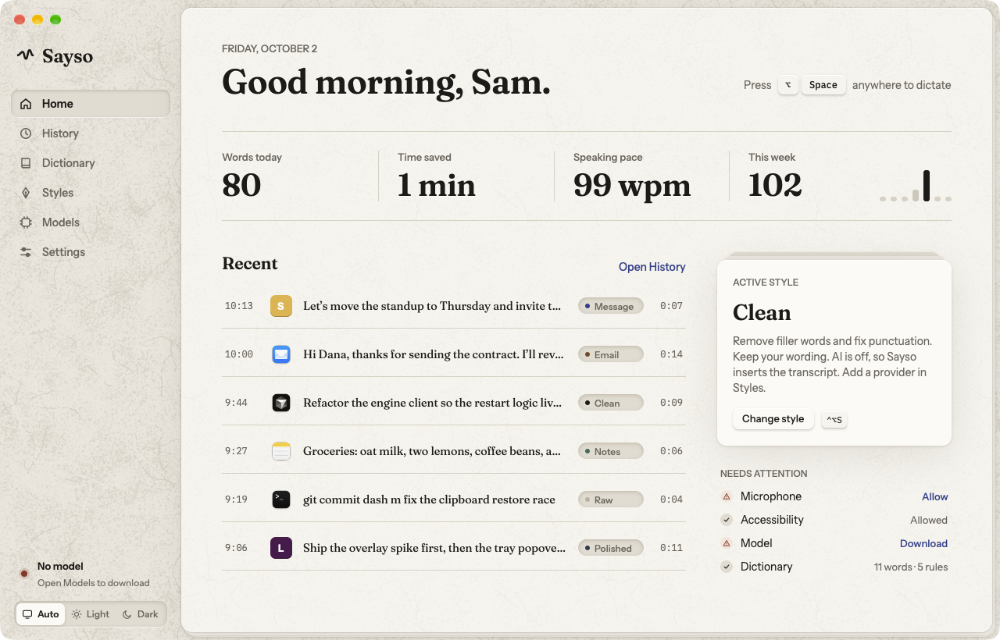

# Sayso

[](https://github.com/watzon/sayso/releases/latest)
[](LICENSE)
[](https://github.com/sponsors/watzon)

Sayso is a dictation app for macOS, Windows, and Linux. You press a key, speak, and Sayso writes the text into the app you are using. Speech recognition runs on your computer: on the Neural Engine of a Mac, and on the processor of a Windows or Linux computer. Nothing leaves the computer unless you choose a cloud model or turn on an AI style with a cloud provider.



Sayso is written in Rust with [GPUI](https://www.gpui.rs/). On macOS the speech engine is a Swift program that uses [WhisperKit](https://github.com/argmaxinc/argmax-oss-swift) and [FluidAudio](https://github.com/FluidInference/FluidAudio). On Windows it is a Rust program that uses [transcribe-rs](https://github.com/cjpais/transcribe-rs) (ONNX Runtime and whisper.cpp). On Linux it is a Rust program that uses [sherpa-onnx](https://github.com/k2-fsa/sherpa-onnx). The same developer made [Pindrop](https://github.com/watzon/pindrop).

## What Sayso does

- **Dictation into any app.** Option+Space (Ctrl+Space on Windows, Ctrl+Alt+Space on Linux) starts a dictation, and the same key stops it. You can also set a push-to-talk key. Sayso pastes the text into the focused app and then restores your clipboard.
- **Live preview.** An overlay shows a waveform, a timer, and the words while you speak.
- **Local models.** On macOS: Parakeet, Nemotron, Cohere Transcribe, Canary, SenseVoice, Paraformer, eight Whisper variants, and Apple Speech on macOS 26. On Windows: Parakeet TDT v2 and v3, and six Whisper variants. On Linux: Parakeet, Whisper, SenseVoice, Moonshine, and a streaming Zipformer. You download the models that you want in the Models page.
- **Cloud models, if you want them.** OpenAI, Groq, ElevenLabs, Deepgram, AssemblyAI, Mistral, or any server with the OpenAI transcription API. You use your own API key.
- **AI styles.** A style rewrites the transcript with a prompt, for example Clean, Polished, Message, Email, or Notes. A style uses an OpenAI-compatible endpoint, the Claude CLI, or the Codex CLI. Raw is the style with no AI. Each style is one TOML file that you can edit.
- **Dictionary.** Words bias the recognition toward names and terms. Replacements change text after transcription, for example "git hub" to "GitHub".
- **History.** Sayso stores each dictation with its transcript, its final text, and its audio. Text stays until you delete it. Audio expires after 30 days by default.
- **Import from Pindrop.** If you used Pindrop on your Mac, Sayso copies your dictations, dictionary, and prompt presets. Find it at the end of onboarding and in Settings › History and privacy.
- **No lost text.** If the insertion or the AI style fails, the text stays on the screen and in History.
- **Config as a file.** All settings are in `config.toml`, and Sayso reloads the file when you save it.

[CONTEXT.md](CONTEXT.md) defines the terms.

## Install

### Supported platforms

Select a button to download the file of the newest release. The [Releases page](https://github.com/watzon/sayso/releases/latest) has all files, each with a `.sha256` file.

| System | Versions | Download |
|---|---|---|
| macOS | 14 or later, on Apple Silicon | [][dmg] |
| Windows | 10 (version 1809) or later, and 11, on a 64-bit Intel or AMD processor | [][exe] |
| Debian, Ubuntu | Debian 12 or later, Ubuntu 22.04 or later | [][deb-x86_64] [][deb-aarch64] |
| Fedora, openSUSE, RHEL family | Fedora, Leap 15.6 or later, Tumbleweed, RHEL 10 | [][rpm-x86_64] [][rpm-aarch64] |
| Linux with Flatpak | Any distribution | [][flatpak-x86_64] [][flatpak-aarch64] |
| Other Linux | glibc 2.35 or later | [][appimage-x86_64] [][appimage-aarch64]<br>[][tarball-x86_64] [][tarball-aarch64] |
| NixOS | Flakes | `nix run github:watzon/sayso` |

Linux runs on X11 and on Wayland. [docs/linux.md](docs/linux.md) lists what works on each desktop.

[dmg]: https://github.com/watzon/sayso/releases/download/v0.4.2/Sayso-0.4.2-macos-arm64.dmg
[exe]: https://github.com/watzon/sayso/releases/download/v0.4.2/Sayso-0.4.2-windows-x64-setup.exe
[deb-x86_64]: https://github.com/watzon/sayso/releases/download/v0.4.2/sayso-0.4.2-linux-x86_64.deb
[deb-aarch64]: https://github.com/watzon/sayso/releases/download/v0.4.2/sayso-0.4.2-linux-aarch64.deb
[rpm-x86_64]: https://github.com/watzon/sayso/releases/download/v0.4.2/sayso-0.4.2-linux-x86_64.rpm
[rpm-aarch64]: https://github.com/watzon/sayso/releases/download/v0.4.2/sayso-0.4.2-linux-aarch64.rpm
[flatpak-x86_64]: https://github.com/watzon/sayso/releases/download/v0.4.2/sayso-0.4.2-linux-x86_64.flatpak
[flatpak-aarch64]: https://github.com/watzon/sayso/releases/download/v0.4.2/sayso-0.4.2-linux-aarch64.flatpak
[appimage-x86_64]: https://github.com/watzon/sayso/releases/download/v0.4.2/sayso-0.4.2-linux-x86_64.AppImage
[appimage-aarch64]: https://github.com/watzon/sayso/releases/download/v0.4.2/sayso-0.4.2-linux-aarch64.AppImage
[tarball-x86_64]: https://github.com/watzon/sayso/releases/download/v0.4.2/sayso-0.4.2-linux-x86_64.tar.gz
[tarball-aarch64]: https://github.com/watzon/sayso/releases/download/v0.4.2/sayso-0.4.2-linux-aarch64.tar.gz

### macOS

1. Download `Sayso-<version>-macos-arm64.dmg` with the button above.
2. Open the DMG and move Sayso to the Applications folder.
3. Open Sayso. Onboarding starts.

The DMG is signed with the Developer ID of Watzon Ventures LLC and notarized by Apple. Each release also has a `.sha256` file. To check your download:

```sh
shasum -a 256 -c Sayso-<version>-macos-arm64.dmg.sha256
```

### Windows

1. Download `Sayso-<version>-windows-x64-setup.exe` with the button above.
2. Open it. It installs Sayso for your user account, without administrator rights.
3. Sayso starts after the install. Onboarding starts.

To check your download, compare the hash with the `.sha256` file:

```powershell
(Get-FileHash Sayso-<version>-windows-x64-setup.exe).Hash
```

If the installer is not signed, Windows SmartScreen asks first. Select **More info › Run anyway**.

### Linux

1. Download the file for your system with a button above. Each file is `sayso-<version>-linux-<arch>` with one of these endings, and `<arch>` is `x86_64` or `aarch64`.

   | File | System | Install |
   |---|---|---|
   | `.deb` | Debian 12 or later, Ubuntu 22.04 or later | `sudo apt install ./sayso-<version>-linux-<arch>.deb` |
   | `.rpm` | Fedora, openSUSE, and the RHEL 10 family | `sudo dnf install ./sayso-<version>-linux-<arch>.rpm` (openSUSE: `sudo zypper install`) |
   | Nix flake | NixOS, and Nix on other distributions | `nix run github:watzon/sayso`. [docs/linux.md](docs/linux.md) has the NixOS configuration. |
   | `.flatpak` | Any distribution with Flatpak | `flatpak install --user ./sayso-<version>-linux-<arch>.flatpak` |
   | `.AppImage` | Other distributions, no install | `chmod +x` the file, then start it |
   | `.tar.gz` | Other distributions | Unpack it and run `./install.sh`. Sayso goes to `~/.local`. `sudo ./install.sh --system` installs it for all users, with the udev rule for Wayland key input. |

2. Open Sayso from your app menu, or start the AppImage. Onboarding starts.

The `.deb`, the `.rpm`, the AppImage, and the tarball need glibc 2.35 or later. The Flatpak brings its own libraries. [docs/linux.md](docs/linux.md) lists the tested distributions and has the details for each desktop.

## First start

1. Choose a model and download it. The default, Parakeet Unified, is about 1.3 GB.
2. Allow the microphone and, on macOS, Accessibility. Sayso needs Accessibility to paste text into other apps. Windows needs no extra permission. On Linux, [docs/linux.md](docs/linux.md) lists the permissions for each desktop.
3. Press Option+Space (Ctrl+Space on Windows, Ctrl+Alt+Space on Linux), speak, and press the key again.

## Privacy

With a local model and the Raw style, your speech and your text stay on the computer. There is no telemetry.

| You turn on | What leaves the computer | Where it goes |
|---|---|---|
| A cloud model | The audio of each dictation and your dictionary words | The speech provider that you added |
| An AI style | The transcript, the style prompt, and your dictionary words | The AI provider of that style |

The official build also looks for a new version when it starts and one time each day. It gets one file from the Releases page of this repository on GitHub. The request names your Sayso version and your system (for example `Sayso/0.3.0 (macos; aarch64)`), and GitHub sees your IP address. It has no identifier of you or your computer. To stop these checks, turn off **Settings › General › Check for updates**. A build from source makes no such request.

The Models page and the Styles page label each cloud destination. Your API keys are in the macOS Keychain, in Windows Credential Manager, or in the Secret Service keyring on Linux.

## License and price

The source code is free software under the [GNU General Public License, version 3](LICENSE). You can read it, change it, and build it for yourself at no cost.

The official build is the signed and notarized app. It is free, and it needs no license key. Sayso is paid for by the people who use it: the download page at [justsayso.app](https://justsayso.app) asks what you want to pay, and $0 is a valid answer.

The name Sayso and the app icon are not part of the license. If you publish a changed version, give it another name and another icon.

## Support Sayso

Sayso has no price, no ads, and no telemetry. The people who use it pay for the work on it.

If you got Sayso from GitHub (a release file, the Nix flake, or a build from source), nothing asked you what you want to pay. If Sayso is useful to you, sponsor its developer:

[](https://github.com/sponsors/watzon)

A one-time amount and a monthly amount are both possible. A sponsorship gives you no extra features: each build of Sayso is the full app.

## Build from source

### macOS

You need Xcode 16 or later and Rust 1.98.1. `rust-toolchain.toml` selects the Rust version.

```sh
git clone https://github.com/watzon/sayso.git
cd sayso
SAYSO_SIGN_IDENTITY=- scripts/bundle.sh
open build/Sayso.app
```

`SAYSO_SIGN_IDENTITY=-` makes an ad hoc signature, which needs no Apple developer account. With an ad hoc signature, macOS asks for the microphone and Accessibility again after each rebuild. To keep the grants, set `SAYSO_SIGN_IDENTITY` to the name of your own signing certificate.

### Windows

You need the Visual Studio 2022 Build Tools (the "Desktop development with C++" workload and a Windows SDK), CMake, LLVM (for libclang; set `LIBCLANG_PATH` when it is not on `PATH`), and Rust 1.98.1.

```powershell
git clone https://github.com/watzon/sayso.git
cd sayso
powershell -ExecutionPolicy Bypass -File scripts\bundle-windows.ps1
build\windows\Sayso\Sayso.exe
```

Add `-Installer` to also make the installer in `dist\`. That needs [Inno Setup 6](https://jrsoftware.org/isinfo.php).

### Linux

You need the packages in `scripts/linux-deps.sh` (Debian and Ubuntu names) and Rust 1.98.1.

```sh
git clone https://github.com/watzon/sayso.git
cd sayso
scripts/linux-deps.sh
scripts/bundle-linux.sh
```

The script makes `build/sayso-<version>-linux-<arch>.tar.gz`. Unpack it and run `./install.sh`. To make the `.deb`, the `.rpm`, the AppImage, and the Flatpak from that tarball, run `scripts/package-linux.sh build/sayso-<version>-linux-<arch>.tar.gz`.

[CONTRIBUTING.md](CONTRIBUTING.md) has the development commands, the checks, and the layout of the code.

## Files on disk

| Kind | macOS | Windows | Linux |
|---|---|---|---|
| Config (`config.toml`, `styles/`) | `~/Library/Application Support/Sayso` | `%APPDATA%\Sayso` | `~/.config/sayso` |
| History, audio, models | `~/Library/Application Support/Sayso` | `%LOCALAPPDATA%\Sayso` | `~/.local/share/sayso` |
| Logs | `~/Library/Caches/Sayso/logs/sayso.log` | `%LOCALAPPDATA%\Sayso\Cache\logs\sayso.log` | `~/.cache/sayso/logs/sayso.log` |

On all three, `~/.config/sayso` wins for the config when it exists, and `$XDG_CONFIG_HOME`, `$XDG_DATA_HOME`, and `$XDG_CACHE_HOME` win over all of them.

API keys are in the Keychain (macOS), in Windows Credential Manager, or in the Secret Service keyring (Linux), under `dev.sayso.Sayso`. The Windows uninstaller keeps your history, models, and settings. To remove them too, delete the two `Sayso` folders above.

## Help and contributions

- To report a bug or ask for a feature, open an [issue](https://github.com/watzon/sayso/issues).
- To report a security problem, follow [SECURITY.md](SECURITY.md). Do not open a public issue.
- To change the code, read [CONTRIBUTING.md](CONTRIBUTING.md).

## More documents

- [docs/plan.md](docs/plan.md): decisions and milestones.
- [docs/research.md](docs/research.md): research and sources.
- [docs/releasing.md](docs/releasing.md): how to make a release.
- [docs/linux.md](docs/linux.md): Sayso on each Linux desktop.
- [docs/porting.md](docs/porting.md): the platform seams, for the next ports.
